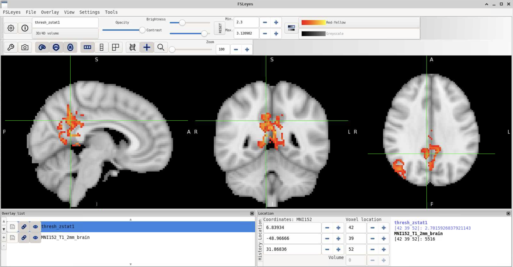

# Magnetic Resonance Imaging in Cognitive Neuroscience (MRICN) - University of Birmingham (Spring 2024)

> Created by Aamir Sohail, University of Birmingham, for the Magnetic 
Resonance Imaging in Cognitive Neuroscience (MRICN) module, Spring Term 2024.

These are the materials for my input to the MRICN module at the University of Birmingham, which consist of three main parts: 

- aamir_vs_chris - this is an introduction to neuroimaging in Python using `nilearn` and `nibabel` (not necessary at all but there if you want to learn).
- fc_conceptual_overview - this is a conceptual introduction to the type of functional connectivity we will be using in our practical (not completely necessary, but potentially useful for understanding what exactly we are measuring).
- fc_tutorial_guide - this is the actual guide you will be doing, which performs a group-level functional connectivity analysis of resting-state data (necessary for everyone!)

Here is a quick description of all three:

## Aamir vs Chris (An introduction to neuroimaging data visualization and analysis using nibabel and nilearn) (Optional)

[](https://colab.research.google.com/github/sohaamir/MRICN/blob/main/aamir_vs_chris/aamir_vs_chris.ipynb) 
[](https://nbviewer.org/github/sohaamir/MRICN/blob/main/aamir_vs_chris/aamir_vs_chris.ipynb)

The `aamir_vs_chris.ipynb` is a Google Colab notebook demonstrating the basic functions of two Python packages, `nibabel` and `nilearn` for manipulating and plotting neuroimaging data. [Nibabel](https://nipy.org/nibabel/) is a Python library primarily used for reading and writing different types of neuroimaging data files, while [Nilearn](https://nilearn.github.io/stable/index.html) is a Python module used for conducting a wide variety of statistical analyses on neuroimaging data.

It is not necessary as part of the module to know this, and we are only scratching the surface of what `nibabel` and `nilearn` can do, but it presents an alternative approach to the conventional GUI-based alternative of FSL/FSLeyes.

Specifically, we go through the following uses: 

### Nibabel
- Accessing the NIFTI metadata
- Data visulization and comparison
- Creating Animated GIFs from MRI Scans

### Nilearn
- Visualizing Brain Overlays
- Plotting Brain Images with Nilearn
- Statistical Analysis of Brain Images

We then can practically demonstrate a simple case of statistical analysis by comparing the size of two brains, my own and [Chris Gorgolewski's](https://github.com/chrisgorgo), a prime contributor to many open-source initiatives in neuroimaging, who's structural T1 scan is made publicly available through [OpenNeuro](https://openneuro.org). 

Ultimately, we do this both using `nilearn` and FSL and end up with the exact same result regardless!

Code for running the voxel comparison test in FSL: 

```bash
# Calculate the number of non-zero voxels for Chris' brain
chris_voxels=$(fslstats chris_bet.nii -V | awk '{print $1}')

# Calculate the number of non-zero voxels for Aamir's brain
aamir_voxels=$(fslstats aamir_bet.nii -V | awk '{print $1}')

# Print the number of voxels
echo "Chris' brain size in voxels: $chris_voxels"
echo "Aamir's brain size in voxels: $aamir_voxels"

# Compare the voxel counts and print who has the bigger brain
if [ "$chris_voxels" -gt "$aamir_voxels" ]; then
    echo "Chris has the bigger brain."
elif [ "$chris_voxels" -lt "$aamir_voxels" ]; then
    echo "Aamir has the bigger brain."
else
    echo "Both brains are the same size."
fi
```


## A conceptual overview of functional connectivity (correlation between time-series)

[](https://colab.research.google.com/github/sohaamir/MRICN/blob/main/fc_tutorial/fc_conceptual_overview.ipynb) [](https://nbviewer.org/github/sohaamir/MRICN/blob/main/fc_tutorial/fc_conceptual_overview.ipynb)

This notebook interactively demonstrates the basis of functional connectivity, as we will define it in our analysis. 

Specifically, using `nilearn`, we can import 'resting-state' fMRI data from the [Richardson dataset](https://openneuro.org/datasets/ds000228/versions/1.0.0) where 'children and adults watched Disney Pixar’s “Partly Cloudy” while lying in the scanner. 

We then parcellate the regions, and take a very crude approach to functional connectivity by getting the mean time-series for each region, and then correlating that with all of the other regions in the brain. Subsequently, we can then plot the most and least-connected regions, as well as the individual time-series for the regions demonstrating the strongest and weakest correlation (or 'connectivity'):


<br>


## Seed-based functional connectivity analysis of resting-state data using FSL

[](https://sohaamir.github.io/MRICN/fc_tutorial_guide.html)

The primary focus of today's workshop is to run a group-level functional connectivity analysis on resting-state fMRI data of three participants. We will specifically look at the functional connectivity of the posterior cingulate cortex (PCC), a region of the default mode network (DMN) that is commonly found to be active in resting-state data.

To do this, we will:

- extract a mean-timeseries for a PCC seed region for each participant,
- run single-subject level analyses, one manually and bash scripting the other two,
- run a group-level analysis using the single-level results
- Finally, we will figure out which brain regions our active voxels are in, using atlases in FSL, and [Neurosynth](https://neurosynth.org/).



